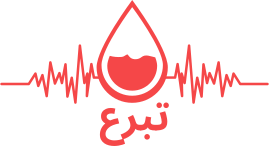

<p align="center"><a href="https://tabaro3.vercel.app/" target="_blank"></a></p>

## tabaro3

This is my fil rouge project at YouCode, and it aims to enhance blood donation in Morocco by connecting potential donors
with those in need. It addresses the challenges of awareness and ease of access in blood donation and the difficulty of
finding donors in emergencies.

## Technologies Used

- Laravel 10 (RESTful API)
- Next.js + TypeScript
- Tailwind CSS
- PostgreSQL

## Getting Started

- Clone the repository

```bash
git clone https://github.com/HMZElidrissi/tabaro3.git
```

- Install dependencies

```bash
cd tabaro3
composer install
```

- Create a `.env` file and copy the contents of `.env.example` to it

```bash
cp .env.example .env
```

- Generate an application key

```bash
php artisan key:generate
```

- Generate a JWT secret

```bash
php artisan jwt:secret
```

- Run the migrations

```bash
php artisan migrate
```

- Start the development server

```bash
php artisan serve
```

## Frontend

> The Frontend is available at [tabaro3 Frontend](https://github.com/HMZElidrissi/tabaro3-frontend)
